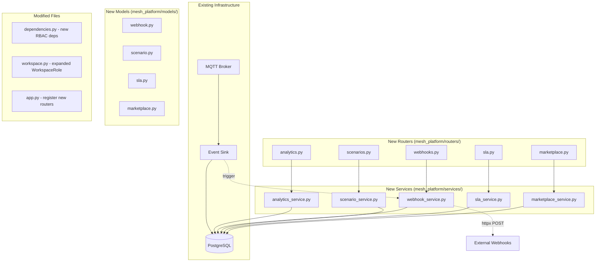

# Design Document: SaaS Platform Enhancements

## Overview

This design covers six enhancements to the MESH SaaS platform, all building on the existing FastAPI + SQLAlchemy async stack. The approach is pragmatic: new SQLAlchemy models for webhooks, scenarios, SLAs, and marketplace templates; new routers following the existing `/api/v1` pattern; aggregation queries over existing event-sourced tables for analytics; and expanded RBAC via an extended `WorkspaceRole` enum with new dependency functions.

All six features share the same architectural patterns already in the codebase: routers → services → models, Pydantic schemas for request/response, and FastAPI dependency injection for auth and workspace access.

**Design decisions:**
- No background task queue (Celery, etc.) — webhook delivery and SLA evaluation are triggered synchronously or via simple async tasks within the request lifecycle. This keeps the implementation within the 2–4 hour window.
- Webhook delivery uses `httpx` (already a dependency) for outbound HTTP calls.
- SLA evaluation is on-demand (called via an endpoint or a periodic check function), not a persistent scheduler.
- Scenario definitions are stored as JSON in a Text column, matching the existing `config_json` and `payload_json` patterns.
- Agent marketplace is global (not workspace-scoped) for template discovery, but instantiation is workspace-scoped.

## Architecture



All new routers are registered in `app.py` with the `/api/v1` prefix, following the existing pattern. Each router uses the existing dependency injection (`DBSession`, `CurrentUser`, `get_workspace`, and new role-based dependencies).

## Components and Interfaces

### Requirement 1: Agent Performance Analytics

**Router:** `mesh_platform/routers/analytics.py`
**Service:** `mesh_platform/services/analytics_service.py`

Three new endpoints, all read-only aggregation queries over existing tables:

| Endpoint | Method | Auth | Description |
|----------|--------|------|-------------|
| `/workspaces/{workspace_id}/analytics/agents` | GET | admin+ | Per-agent performance metrics |
| `/workspaces/{workspace_id}/analytics/orders/timeline` | GET | admin+ | Order phase transition durations |
| `/workspaces/{workspace_id}/analytics/economic` | GET | admin+ | Ledger aggregate statistics |

All accept `days` query parameter (default 30, 1–365).

**Agent metrics** query:
- `OrderEvent` grouped by `agent_id` → total orders handled, count of "settled" events for success rate
- Settlement time: difference between first "request" event and last "settled" event per order, averaged per agent
- Latest `ReputationSnapshot` per agent for current reputation score

**Order timeline** query:
- For each order, select all `OrderEvent` records ordered by `occurred_at`
- Compute duration between consecutive phase transitions
- Return as list of `{order_id, phases: [{from, to, duration_seconds}]}`

**Economic health** query:
- `LedgerEntry` aggregates: `SUM(amount)` for total volume, `AVG(amount)` for avg transaction size, count by `tx_type`
- Escrow utilization: `COUNT(released=True) / COUNT(*)` from `EscrowRecord`
- Burn amount: `SUM(amount)` where `tx_type = 'burn'`

### Requirement 2: Webhook and Integration Layer

**Router:** `mesh_platform/routers/webhooks.py`
**Service:** `mesh_platform/services/webhook_service.py`
**Model:** `mesh_platform/models/webhook.py`

| Endpoint | Method | Auth | Description |
|----------|--------|------|-------------|
| `/workspaces/{workspace_id}/webhooks` | POST | owner | Register webhook |
| `/workspaces/{workspace_id}/webhooks` | GET | owner | List webhooks |
| `/workspaces/{workspace_id}/webhooks/{webhook_id}` | DELETE | owner | Remove webhook |
| `/workspaces/{workspace_id}/webhooks/{webhook_id}/deliveries` | GET | owner | Delivery history |
| `/workspaces/{workspace_id}/triggers/orders` | POST | operator+ | Inbound order trigger |

**Webhook delivery flow:**
1. Event sink persists an MQTT event
2. After persistence, the sink calls `webhook_service.dispatch_event(db, workspace_id, event_type, payload)`
3. The service queries active webhooks for that workspace + event type
4. For each matching webhook, it creates a `WebhookDelivery` record and fires an async `httpx.post`
5. On failure, it schedules retries (up to 3) with exponential backoff delays

**HMAC signature:** `X-Mesh-Signature: sha256={hmac_sha256(secret, body)}`

**Inbound trigger:** Accepts order parameters, creates an `Order` record, and publishes to `mesh/{slug}/orders/+/request` via MQTT.

### Requirement 3: Custom Scenario Builder

**Router:** `mesh_platform/routers/scenarios.py`
**Service:** `mesh_platform/services/scenario_service.py`
**Model:** `mesh_platform/models/scenario.py`

| Endpoint | Method | Auth | Description |
|----------|--------|------|-------------|
| `/workspaces/{workspace_id}/scenarios` | POST | owner | Create scenario |
| `/workspaces/{workspace_id}/scenarios` | GET | viewer+ | List scenarios |
| `/workspaces/{workspace_id}/scenarios/{scenario_id}` | GET | viewer+ | Get scenario |
| `/workspaces/{workspace_id}/scenarios/{scenario_id}` | PUT | owner | Update scenario |
| `/workspaces/{workspace_id}/scenarios/{scenario_id}` | DELETE | owner | Delete scenario |

Scenario definitions are stored as a JSON blob in a `Text` column (`definition_json`). The Pydantic schema validates the structure on input, and the service serializes/deserializes.

**Validation rules:**
- At least one agent with `role = "buyer"`
- At least one agent with `role = "supplier"`
- At least one goods definition
- Each goods definition must have `name` (non-empty), `category` (non-empty), `base_price > 0`

**Built-in scenarios:** The list endpoint appends system scenarios (from `mesh/scenarios/`) as read-only entries with `is_system = True`.

### Requirement 4: SLA Monitoring and Alerts

**Router:** `mesh_platform/routers/sla.py`
**Service:** `mesh_platform/services/sla_service.py`
**Model:** `mesh_platform/models/sla.py`

| Endpoint | Method | Auth | Description |
|----------|--------|------|-------------|
| `/workspaces/{workspace_id}/sla/rules` | POST | admin+ | Create SLA rule |
| `/workspaces/{workspace_id}/sla/rules` | GET | admin+ | List SLA rules |
| `/workspaces/{workspace_id}/sla/rules/{rule_id}` | DELETE | admin+ | Delete SLA rule |
| `/workspaces/{workspace_id}/sla/evaluate` | POST | admin+ | Trigger SLA evaluation |
| `/workspaces/{workspace_id}/sla/alerts` | GET | admin+ | List active alerts |
| `/workspaces/{workspace_id}/sla/alerts/{alert_id}/acknowledge` | POST | admin+ | Acknowledge alert |

**Metric types and computation:**
- `order_settlement_time`: Average seconds from first "request" to "settled" OrderEvent in the check interval
- `agent_uptime`: Percentage of heartbeat intervals where agent status was "active" in AgentStatusLog
- `order_success_rate`: Percentage of orders reaching "settled" status out of all orders created in the interval

**Evaluation logic:**
```python
if operator == "greater_than" and actual_value > threshold:
    create_alert(...)
elif operator == "less_than" and actual_value < threshold:
    create_alert(...)
```

### Requirement 5: Enhanced RBAC

**Modified files:**
- `mesh_platform/models/workspace.py` — extend `WorkspaceRole` enum
- `mesh_platform/dependencies.py` — add new dependency functions
- `mesh_platform/routers/workspaces.py` — add role assignment endpoint

**Extended roles:**

| Role | Level | Access |
|------|-------|--------|
| owner | 6 | Everything |
| admin | 5 | Everything except ownership transfer |
| operator | 4 | Agent management, scenario execution, orders |
| developer | 3 | API keys, SDK endpoints |
| auditor | 2 | Analytics, audit logs, webhook history (read-only) |
| viewer | 1 | Read-only access to workspace data |

**New dependency functions:**

```python
async def require_workspace_operator(workspace_id, user, db) -> WorkspaceMembership:
    """Permits owner, admin, operator."""

async def require_workspace_auditor(workspace_id, user, db) -> WorkspaceMembership:
    """Permits owner, admin, auditor."""

async def require_workspace_developer(workspace_id, user, db) -> WorkspaceMembership:
    """Permits owner, admin, developer."""
```

**Role hierarchy for escalation prevention:**
A dict mapping each role to its numeric level. A user can only assign roles with a level strictly less than their own.

```python
ROLE_LEVELS = {
    "owner": 6, "admin": 5, "operator": 4,
    "developer": 3, "auditor": 2, "viewer": 1,
}
```

**New endpoint:** `PUT /workspaces/{workspace_id}/members/{user_id}/role`

### Requirement 6: Agent Marketplace

**Router:** `mesh_platform/routers/marketplace.py`
**Service:** `mesh_platform/services/marketplace_service.py`
**Model:** `mesh_platform/models/marketplace.py`

| Endpoint | Method | Auth | Description |
|----------|--------|------|-------------|
| `/marketplace/templates` | POST | any authenticated | Register template |
| `/marketplace/templates` | GET | any authenticated | Search/list templates |
| `/marketplace/templates/{template_id}` | GET | any authenticated | Get template detail |
| `/marketplace/templates/{template_id}` | PUT | author only | Update template |
| `/workspaces/{workspace_id}/marketplace/instantiate/{template_id}` | POST | admin+ | Instantiate template |

**Search:** Query parameter `q` for text search (name/description LIKE), `role` filter, `capability` filter. Results ordered by `usage_count DESC`.

**Instantiation:** Creates an `AgentDefinition` in the target workspace using template defaults. Request body can include `overrides: {initial_balance, capabilities}`. Increments `usage_count` on the template.

**Name validation:** 3–100 characters, unique across all templates.

## Data Models

### WebhookRegistration

```python
class WebhookRegistration(Base):
    __tablename__ = "webhook_registrations"

    id: Mapped[str]           # PK, uuid4
    workspace_id: Mapped[str] # FK workspaces.id
    url: Mapped[str]          # HTTPS URL
    event_types: Mapped[str]  # JSON array of event type strings
    secret: Mapped[str]       # HMAC secret (stored encrypted or hashed)
    is_active: Mapped[bool]   # default True
    created_at: Mapped[datetime]
```

### WebhookDelivery

```python
class WebhookDelivery(Base):
    __tablename__ = "webhook_deliveries"

    id: Mapped[int]              # PK, autoincrement
    webhook_id: Mapped[str]      # FK webhook_registrations.id
    event_type: Mapped[str]      # e.g. "order.request"
    payload_json: Mapped[str]    # JSON payload sent
    status: Mapped[str]          # "pending", "success", "failed"
    http_status_code: Mapped[int | None]
    response_body: Mapped[str | None]  # truncated to 1000 chars
    attempt_number: Mapped[int]  # 1, 2, 3
    delivered_at: Mapped[datetime | None]
    created_at: Mapped[datetime]
```

### Scenario

```python
class Scenario(Base):
    __tablename__ = "scenarios"

    id: Mapped[str]              # PK, uuid4
    workspace_id: Mapped[str]    # FK workspaces.id
    name: Mapped[str]            # 3-200 chars
    description: Mapped[str]     # optional
    duration_seconds: Mapped[int]
    definition_json: Mapped[str] # Full scenario definition as JSON
    is_system: Mapped[bool]      # default False (True for built-in)
    created_at: Mapped[datetime]
    updated_at: Mapped[datetime | None]
```

**Scenario definition JSON structure** (validated by Pydantic schema):

```json
{
  "agents": [
    {"role": "buyer", "count": 1, "initial_balance": 5000, "capabilities": ["electronics"]},
    {"role": "supplier", "count": 2, "initial_balance": 5000, "capabilities": ["electronics"]}
  ],
  "goods": [
    {"name": "Laptop Display", "category": "electronics", "base_price": 100.0, "volatility": 0.1}
  ],
  "orders": [
    {"at_second": 10, "goods": "Laptop Display", "category": "electronics", "quantity": 50, "max_price_per_unit": 120, "quality_threshold": 0.85}
  ],
  "chaos_events": [
    {"at_second": 70, "event_type": "kill_agent", "target": "supplier"}
  ]
}
```

### SLARule

```python
class SLARule(Base):
    __tablename__ = "sla_rules"

    id: Mapped[str]              # PK, uuid4
    workspace_id: Mapped[str]    # FK workspaces.id
    metric_type: Mapped[str]     # "order_settlement_time", "agent_uptime", "order_success_rate"
    threshold: Mapped[float]
    operator: Mapped[str]        # "less_than", "greater_than"
    check_interval_seconds: Mapped[int]  # e.g. 300
    is_active: Mapped[bool]      # default True
    created_at: Mapped[datetime]
```

### SLAAlert

```python
class SLAAlert(Base):
    __tablename__ = "sla_alerts"

    id: Mapped[str]              # PK, uuid4
    workspace_id: Mapped[str]    # FK workspaces.id
    rule_id: Mapped[str]         # FK sla_rules.id
    metric_type: Mapped[str]
    actual_value: Mapped[float]
    threshold_value: Mapped[float]
    breached_at: Mapped[datetime]
    acknowledged: Mapped[bool]   # default False
    acknowledged_by: Mapped[str | None]  # FK users.id
    acknowledged_at: Mapped[datetime | None]
```

### AgentTemplate

```python
class AgentTemplate(Base):
    __tablename__ = "agent_templates"

    id: Mapped[str]              # PK, uuid4
    name: Mapped[str]            # unique, 3-100 chars
    description: Mapped[str]
    agent_role: Mapped[str]      # buyer, supplier, logistics, inspector, oracle
    capabilities_json: Mapped[str]  # JSON array of capability strings
    default_initial_balance: Mapped[float]
    config_json: Mapped[str]     # JSON object of config parameters
    author_id: Mapped[str]       # FK users.id
    usage_count: Mapped[int]     # default 0
    created_at: Mapped[datetime]
    updated_at: Mapped[datetime | None]
```

### Extended WorkspaceRole

```python
class WorkspaceRole(str, PyEnum):
    owner = "owner"
    admin = "admin"
    operator = "operator"
    developer = "developer"
    auditor = "auditor"
    viewer = "viewer"
```

## Correctness Properties

*A property is a characteristic or behavior that should hold true across all valid executions of a system — essentially, a formal statement about what the system should do. Properties serve as the bridge between human-readable specifications and machine-verifiable correctness guarantees.*

### Property 1: Analytics aggregation correctness

*For any* set of OrderEvent and LedgerEntry records in a workspace within a time range, the analytics service SHALL compute per-agent order counts equal to the count of distinct order IDs in their events, total ledger volume equal to the sum of all LedgerEntry amounts, and average transaction size equal to total volume divided by transaction count.

**Validates: Requirements 1.1, 1.3**

### Property 2: Order lifecycle duration computation

*For any* order with a sequence of OrderEvent records with known timestamps, the timeline service SHALL compute the duration between consecutive phase transitions as the difference in seconds between their `occurred_at` timestamps, and the sum of all phase durations SHALL equal the total time from first to last event.

**Validates: Requirements 1.2**

### Property 3: Webhook HTTPS URL validation

*For any* URL string, webhook registration SHALL succeed only if the URL starts with `https://`, and SHALL reject all URLs using other protocols (http, ftp, ws, etc.).

**Validates: Requirements 2.6**

### Property 4: Scenario serialization round-trip

*For any* valid scenario definition (containing agents, goods, orders, and optional chaos events), serializing the definition to JSON and deserializing it back SHALL produce an object equal to the original definition.

**Validates: Requirements 3.1, 3.4**

### Property 5: Scenario validation rejects invalid definitions

*For any* scenario definition missing a buyer agent, missing a supplier agent, missing all goods definitions, or containing a goods definition with an empty name, empty category, or base_price ≤ 0, the validation SHALL reject the definition.

**Validates: Requirements 3.2, 3.7**

### Property 6: SLA breach detection correctness

*For any* SLA rule with a metric type, threshold value, and comparison operator, and *for any* actual metric value, the evaluation SHALL detect a breach if and only if: (operator is "greater_than" AND actual > threshold) OR (operator is "less_than" AND actual < threshold).

**Validates: Requirements 4.2**

### Property 7: RBAC permission check

*For any* workspace role and *for any* permission level (admin, operator, auditor, developer), access SHALL be granted if and only if the role is in the permitted set for that level: admin permits {owner, admin}; operator permits {owner, admin, operator}; auditor permits {owner, admin, auditor}; developer permits {owner, admin, developer}.

**Validates: Requirements 5.2, 5.3, 5.4, 5.5**

### Property 8: Role escalation prevention

*For any* user with a current workspace role, attempting to assign themselves a role with a strictly higher level in the hierarchy (viewer=1 < auditor=2 < developer=3 < operator=4 < admin=5 < owner=6) SHALL be rejected.

**Validates: Requirements 5.7**

### Property 9: Marketplace search returns filtered and ordered results

*For any* set of agent templates and *for any* search filter (by role or capability), all returned templates SHALL match the filter criteria, and results SHALL be ordered by usage_count descending.

**Validates: Requirements 6.2**

### Property 10: Template instantiation merges defaults with overrides

*For any* agent template and *for any* set of parameter overrides, the resulting AgentDefinition SHALL use the override value for each overridden field and the template's default value for all non-overridden fields.

**Validates: Requirements 6.4**

### Property 11: Template name validation

*For any* string, template name validation SHALL accept the string if and only if its length is between 3 and 100 characters inclusive. Duplicate names SHALL be rejected.

**Validates: Requirements 6.6**

## Error Handling

All new endpoints follow the existing error handling patterns:

| Condition | HTTP Status | Detail |
|-----------|-------------|--------|
| Resource not found | 404 | `"{resource} not found"` |
| Insufficient permissions | 403 | `"{role} access required"` |
| Validation failure | 422 | Pydantic validation errors (automatic) |
| Duplicate resource | 409 | `"Already exists"` |
| Self-escalation attempt | 403 | `"Cannot escalate own role"` |
| Non-HTTPS webhook URL | 400 | `"Webhook URL must use HTTPS"` |
| Invalid scenario definition | 400 | `"Scenario must contain at least one buyer agent"` (etc.) |

**Webhook delivery errors:** Logged in `WebhookDelivery` records with HTTP status code and truncated response body. After 3 failed attempts, the delivery is marked as permanently failed. The webhook registration remains active for future events.

**SLA evaluation errors:** If a metric computation fails (e.g., division by zero when no orders exist), the metric returns a default value (0.0 for rates, 0 for times) rather than creating a false alert.

## Testing Strategy

**Test framework:** pytest + pytest-asyncio with async SQLite (matching existing `platform_tests/` setup).

**Property-based testing library:** [Hypothesis](https://hypothesis.readthedocs.io/) — the standard PBT library for Python. Each property test runs a minimum of 100 iterations.

**Dual testing approach:**

- **Unit tests (example-based):** Cover specific scenarios, edge cases, and error conditions for each endpoint. Focus on:
  - Empty data returns zero-valued metrics (Req 1.5)
  - Webhook retry behavior (Req 2.3, 2.4)
  - Scenario CRUD operations (Req 3.3, 3.5, 3.6)
  - SLA alert acknowledgment (Req 4.5)
  - Role assignment (Req 5.6)
  - Template CRUD and usage count (Req 6.3, 6.5, 6.7)

- **Property tests (Hypothesis):** Cover universal properties across generated inputs. Each test is tagged with its design property reference:
  - Tag format: **Feature: saas-platform-enhancements, Property {N}: {title}**
  - Minimum 100 iterations per property
  - Properties 1–11 as defined in the Correctness Properties section above

**Test file structure:**
```
platform_tests/
├── conftest.py                          # Existing — add new model imports
├── test_analytics.py                    # Req 1 unit + property tests
├── test_webhooks.py                     # Req 2 unit tests
├── test_scenarios.py                    # Req 3 unit + property tests
├── test_sla.py                          # Req 4 unit + property tests
├── test_rbac.py                         # Req 5 property tests
├── test_marketplace.py                  # Req 6 unit + property tests
└── test_scenario_serialization.py       # Req 3.4 round-trip property test
```

**Integration tests:** Endpoint-level tests using the httpx ASGI transport client (existing pattern), verifying full request → response cycles including auth, workspace access, and database persistence.
