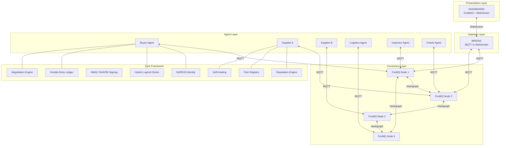
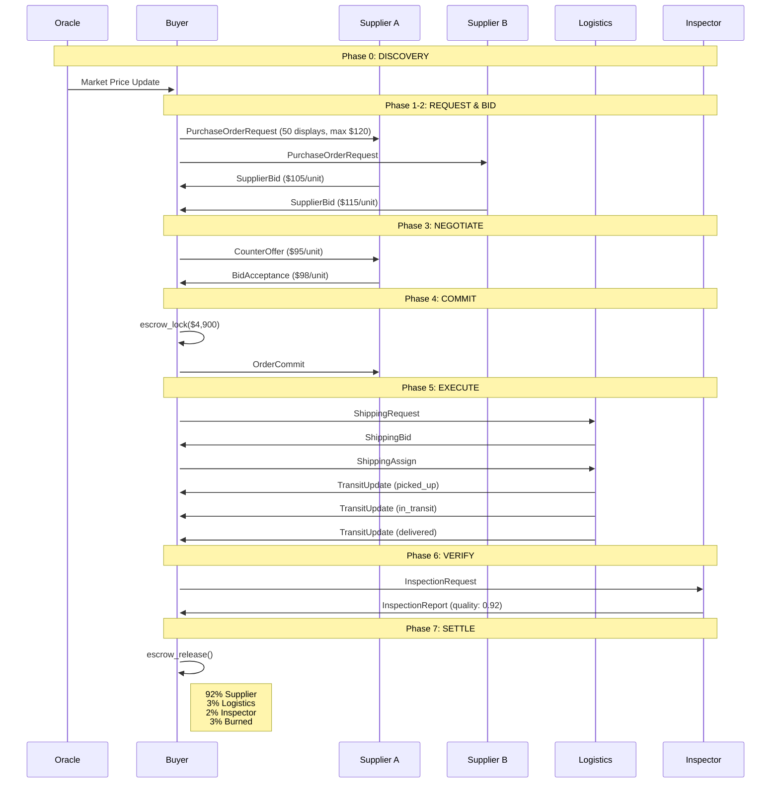
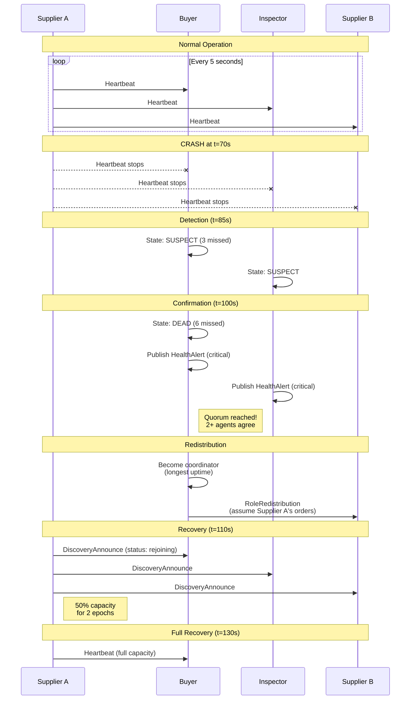
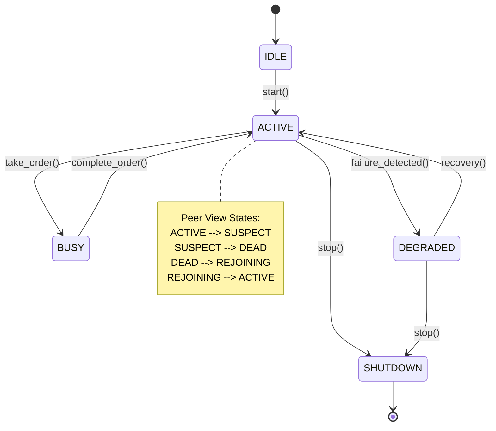
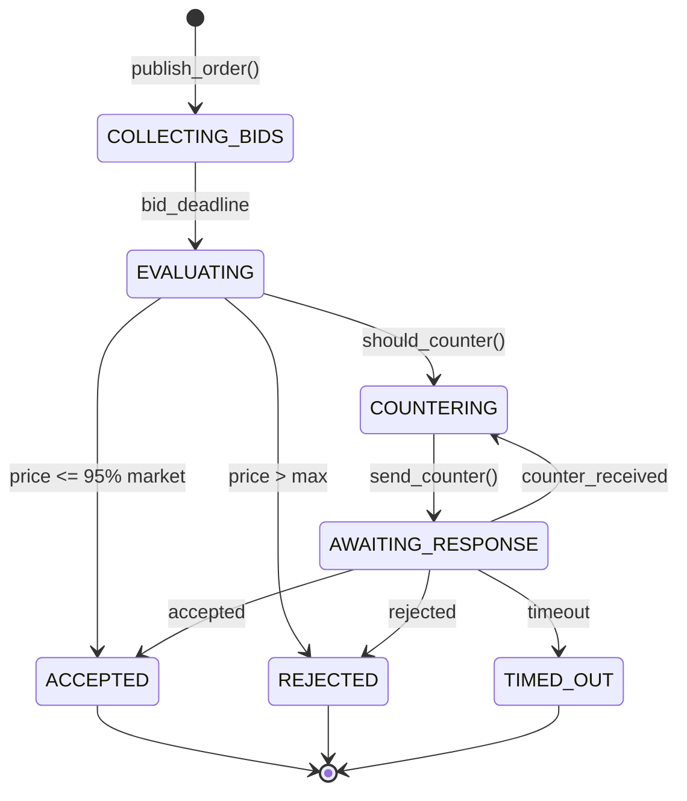
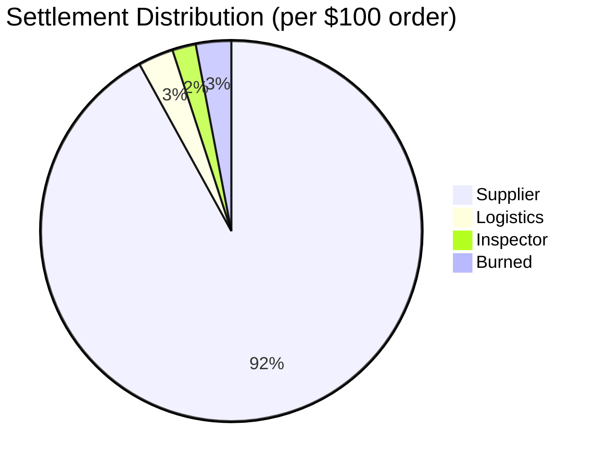
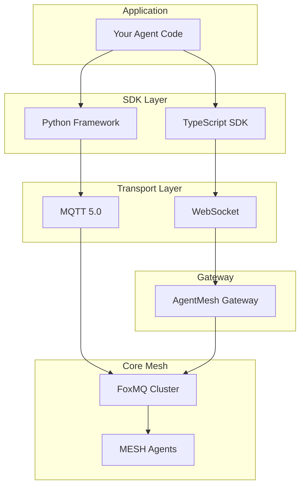

# MESH Architecture Diagrams

## System Overview



## Order Lifecycle Flow



## Self-Healing Protocol



## Agent State Machine



## Negotiation State Machine



## Economic Model



## Message Flow Architecture

```mermaid
graph LR
    subgraph "Discovery"
        A1[mesh/discovery/announce]
        A2[mesh/discovery/heartbeat]
        A3[mesh/discovery/goodbye]
    end
    
    subgraph "Orders"
        B1[orders/{id}/request]
        B2[orders/{id}/bid]
        B3[orders/{id}/counter]
        B4[orders/{id}/accept]
        B5[orders/{id}/commit]
    end
    
    subgraph "Shipping"
        C1[shipping/{id}/request]
        C2[shipping/{id}/bid]
        C3[shipping/{id}/assign]
        C4[shipping/{id}/transit]
    end
    
    subgraph "Quality"
        D1[quality/{id}/request]
        D2[quality/{id}/report]
    end
    
    subgraph "Economy"
        E1[ledger/transactions]
        E2[ledger/escrow]
        E3[reputation/updates]
    end
    
    subgraph "Health"
        F1[mesh/health/alerts]
        F2[mesh/health/redistribution]
    end
```

## Security Model

```mermaid
graph TB
    subgraph "Identity Layer"
        ED[Ed25519 Keypair]
        ID[Agent ID = SHA-256(pubkey)[:16]]
    end
    
    subgraph "Message Layer"
        PL[Payload]
        HL[Header + HLC]
        CJ[Canonical JSON]
        HM[HMAC-SHA256]
        RD[Replay Detector]
    end
    
    subgraph "Consensus Layer"
        BFT[BFT Ordering<br/>FoxMQ Hashgraph]
    end
    
    ED --> ID
    PL --> CJ
    HL --> CJ
    CJ --> HM
    HM --> RD
    RD --> BFT
```

## SDK Architecture


